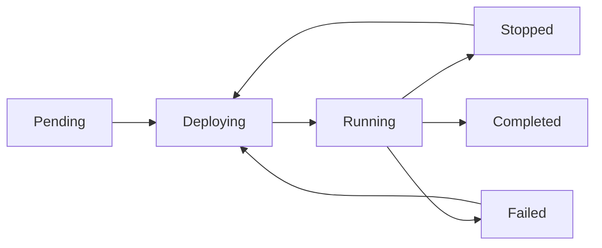

# Pipelines

A Flow pipeline is a managed Stellar data process. It reads ledger data from a source adapter, runs one or more processors, and writes records to one or more consumers.

```text
source → processor(s) → consumer(s)
```

Use Flow when you need a custom stream or custom destination. Use [Lake](/docs/lake/overview) when you only need to query standard decoded Stellar data.

## Pipeline YAML shape

The Pipeline API accepts Kubernetes-style Flow resources. The source adapter is derived from `spec.network` and the ledger range.

```yaml
apiVersion: flow.obsrvr.com/v1
kind: Pipeline
metadata:
  name: ContractEventsToPostgres
spec:
  network: testnet
  startLedger: "2434280"
  endLedger: "2434281"
  processors:
    - type: contract_event
      config:
        network_passphrase: Test SDF Network ; September 2015
  consumers:
    - type: contract_events_postgres
      config:
        host: postgres.example.com
        port: 23548
        connect_timeout: 30
        database: defaultdb
        username: avnadmin
        password: ${POSTGRES_PASSWORD}
        sslmode: require
        schema: public
        table_prefix: stellar_
```

## Spec

| Field | Meaning |
|-------|---------|
| `metadata.name` | Pipeline name. `apply` matches existing pipelines by name. |
| `spec.network` | `testnet` or `mainnet`. |
| `spec.startLedger` | First ledger to process, or `latest` / `genesis`. |
| `spec.endLedger` | Optional final ledger. Omit for continuous processing. |
| `spec.processors` | Processor list using registry IDs. |
| `spec.consumers` | Consumer list using registry IDs. |

For mainnet, use:

```yaml
network: mainnet
```

For testnet, use:

```yaml
network: testnet
```

## Processors

Processors transform source records into records consumers can write.

```yaml
processors:
  - type: contract_event
    config:
      network_passphrase: Test SDF Network ; September 2015
```

Use the correct network passphrase:

| Network | Passphrase |
|---------|------------|
| mainnet | `Public Global Stellar Network ; September 2015` |
| testnet | `Test SDF Network ; September 2015` |

## Consumers

Consumers write processed records to a destination.

```yaml
consumers:
  - type: contract_events_postgres
    config:
      host: postgres.example.com
      port: 5432
      connect_timeout: 30
      database: defaultdb
      username: postgres
      password: ${POSTGRES_PASSWORD}
      sslmode: require
      schema: public
      table_prefix: stellar_
```

Do not commit real database passwords. Use placeholders, CI secrets, or a secret manager.

## Lifecycle



| State | Meaning |
|-------|---------|
| `pending` | Config exists and is ready for deployment |
| `deploying` | Flow is allocating and starting runtime resources |
| `running` | Pipeline is processing ledgers |
| `stopped` | Pipeline is paused by a user or API call |
| `failed` | Pipeline stopped because of an error |
| `completed` | Bounded pipeline reached `endLedger` |

## Bounded and continuous pipelines

A bounded pipeline has `endLedger` and completes after that ledger.

```yaml
startLedger: "2434280"
endLedger: "2434281"
```

A continuous pipeline omits `endLedger`.

```yaml
startLedger: "2434280"
```

## Create, update, and apply

Flow supports three API patterns.

| Pattern | Endpoint | Use it when |
|---------|----------|-------------|
| Create | `POST /api/v1/flow/pipelines/` | You want a new pipeline every time |
| Update | `PUT /api/v1/flow/pipelines/{uuid}/` | You know the pipeline UUID |
| Apply | `POST /api/v1/flow/pipelines/apply/` | You want GitOps-style create/update by name |

`apply` is the best default for CI/CD. It creates the pipeline if it does not exist and updates it if it does.

Running pipelines cannot be updated. Stop the pipeline first.

## Validation

Validate a pipeline without creating it:

```bash
curl -X POST \
  -H "Authorization: Api-Key $API_KEY" \
  -H "Content-Type: text/yaml" \
  --data-binary @pipeline.yaml \
  "$CONSOLE/api/v1/flow/pipelines/validate/"
```

## Registry

Use the registry endpoints to discover available processors and consumers.

```bash
curl -H "Authorization: Api-Key $API_KEY" \
  "$CONSOLE/api/v1/flow/registry/processors/"

curl -H "Authorization: Api-Key $API_KEY" \
  "$CONSOLE/api/v1/flow/registry/consumers/"
```

## Billing behavior

Flow is metered by runtime. Billing starts when a pipeline is running and stops when it is stopped, completed, or failed.

Creating a pipeline through the API requires an active subscription unless your team has unbilled pipeline access. If the team is missing a subscription, create/apply returns `402 Payment Required`.

## Next steps

- [Create a pipeline with the API](/docs/flow/getting-started/quickstart)
- [Pipeline API reference](/docs/flow/api)
- [Processors](/docs/flow/processors/)
- [Consumers](/docs/flow/consumers/)
