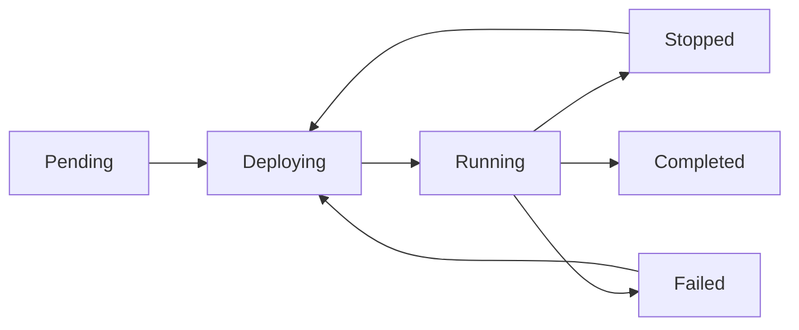

# Understanding Pipelines

Pipelines are the core abstraction in Flow, representing a complete data processing workflow from source to destination. Each pipeline defines how blockchain data flows through your system, what transformations to apply, and where to deliver the results.

## Pipeline Architecture

A Flow pipeline consists of three main component types orchestrated by flowctl:

```
┌─────────────────────────────────────────────────────────┐
│              Flow Orchestrator (flowctl)                 │
│  • Component Management                                 │
│  • Health Monitoring                                    │
│  • Stream Coordination                                  │
└─────────────────────┬───────────────────────────────────┘
                      │
      ┌───────────────┼───────────────┐
      ▼               ▼               ▼
┌─────────────┐ ┌──────────────┐ ┌─────────────┐
│   Source    │─▶│  Processor   │─▶│    Sink     │
│  (Network)  │ │ (Transform)  │ │(Destination)│
└─────────────┘ └──────────────┘ └─────────────┘
```

### 1. Source
Data producers that fetch from blockchain networks:
- **Stellar Mainnet**: Production network data
- **Stellar Testnet**: Development network data
- **Cloud Storage**: Historical data from GCS/S3
- **Starting Point**: Latest, genesis, or specific ledger

### 2. Processor
Data transformers that filter and structure blockchain data:
- Filters relevant information
- Extracts specific events or transactions
- Can be chained for complex transformations
- Built using [flowctl-sdk](https://github.com/withObsrvr/flowctl-sdk)

### 3. Sink (Consumer)
Data consumers that deliver to your infrastructure:
- **Databases**: PostgreSQL, Redis, DuckDB
- **Streaming**: Webhooks, Kafka, ZeroMQ
- **Storage**: S3, local files
- Built using [flowctl-sdk](https://github.com/withObsrvr/flowctl-sdk)

### Orchestration

Flow uses [flowctl](https://github.com/withobsrvr/flowctl) to orchestrate all components:
- Automatic component registration and health monitoring
- gRPC-based data streaming between components
- Graceful error handling and recovery
- Real-time metrics and observability

## Pipeline Lifecycle

### States

Pipelines progress through several states during their lifecycle:



- **Pending**: Configuration validated, awaiting deployment
- **Deploying**: Resources being allocated and services starting
- **Running**: Actively processing data
- **Stopped**: Manually paused by user
- **Failed**: Error occurred during processing
- **Completed**: Finished processing (for historical ranges)

### Deployment Process

1. **Validation**: Configuration checked for errors
2. **Security**: Credentials stored in Vault
3. **Orchestration**: Services deployed via Nomad
4. **Initialization**: Processors connect to data source
5. **Processing**: Data flow begins

## Configuration

Flow uses the flowctl configuration format for defining pipelines. This provides a consistent, powerful way to describe your data processing workflows.

### Basic Configuration

```yaml
apiVersion: flowctl/v1
kind: Pipeline
metadata:
  name: payment-tracker
  description: Track payments with specific memo patterns

spec:
  driver: process  # Managed by Flow infrastructure

  sources:
    - id: stellar-source
      command: ["stellar-live-source"]
      env:
        NETWORK: "mainnet"
        START_LEDGER: "latest"

  processors:
    - id: payments-filter
      command: ["payments-memo-processor"]
      inputs: ["stellar-source"]
      env:
        MEMO_TEXT: "REF"
        MIN_AMOUNT: "100"

  sinks:
    - id: postgres-sink
      command: ["postgres-consumer"]
      inputs: ["payments-filter"]
      env:
        CONNECTION_STRING: "postgresql://..."
        BATCH_SIZE: "50"
```

**Key concepts:**
- `apiVersion: flowctl/v1` - Standard configuration format
- `spec.driver` - Execution environment (Flow manages this for you)
- `sources` - Data producers (Stellar network, cloud storage)
- `processors` - Data transformers (filters, extractors)
- `sinks` - Data consumers (databases, webhooks)
- `inputs` - Explicit connections between components

### Advanced Configuration

#### Multiple Processors

Chain processors for complex logic:

```yaml
processors:
  - id: contract-filter
    command: ["contract-filter-processor"]
    inputs: ["stellar-source"]
    env:
      CONTRACT_IDS: "CCTOKEN..."

  - id: event-extractor
    command: ["contract-event-processor"]
    inputs: ["contract-filter"]  # Chain from filter
    env:
      EXTRACT_ALL: "true"
```

#### Multiple Sinks (Fan-Out)

Send data to multiple destinations:

```yaml
sinks:
  - id: postgres-sink
    command: ["postgres-consumer"]
    inputs: ["event-extractor"]
    env:
      CONNECTION_STRING: "postgresql://..."
      BATCH_SIZE: "50"

  - id: webhook-sink
    command: ["webhook-consumer"]
    inputs: ["event-extractor"]  # Same input as postgres
    env:
      URL: "https://api.example.com/events"
      RETRY_COUNT: "3"
```

### Configuration via Flow Console

When using the Flow Console UI, the configuration is generated automatically based on your selections. For advanced use cases or self-hosted deployments, you can write the YAML directly.

## Data Flow Patterns

### Linear Processing
Simple source → processor → consumer flow:
```
Network → Payments Processor → PostgreSQL
```

### Filtered Processing
Pre-filter before main processing:
```
Network → Contract Filter → Event Processor → Webhook
```

### Fan-Out Processing
One source, multiple destinations:
```
Network → Transaction Processor → PostgreSQL
                               └→ S3 Archive
```

### Complex DAG
Directed Acyclic Graph for advanced scenarios:
```
Network → Raw Transactions → Filter A → PostgreSQL
                          └→ Filter B → Kafka
```

## Performance Characteristics

### Throughput

Factors affecting pipeline throughput:

1. **Processor Complexity**: Simple filters > Complex transformations
2. **Network Selection**: Testnet typically has lower volume
3. **Consumer Batch Size**: Larger batches = higher throughput
4. **Data Volume**: Account-specific > Network-wide

### Latency

Expected latencies by configuration:

- **Real-time** (batch_size: 1): 100-500ms
- **Near real-time** (batch_size: 10): 1-5 seconds
- **Batch** (batch_size: 100): 10-30 seconds

### Resource Usage

Pipeline resource consumption varies by:

- **Data Volume**: More data = more resources
- **Processor Type**: Complex processors use more CPU
- **Consumer Type**: Database consumers may use more memory
- **Historical Processing**: Genesis start uses more resources

## Monitoring & Observability

### Metrics

Flow provides built-in metrics:

- **Events Processed**: Total count and rate
- **Processing Latency**: Time from ledger close to delivery
- **Error Rate**: Failed events percentage
- **Consumer Lag**: Backlog size

### Logs

Real-time log streaming includes:

- **System Logs**: Deployment and lifecycle events
- **Processing Logs**: Data flow information
- **Error Logs**: Detailed error messages
- **Debug Logs**: Verbose troubleshooting info

### Health Checks

Automatic health monitoring:

```json
{
  "pipeline_id": "pipe_123",
  "status": "running",
  "health": {
    "processor": "healthy",
    "consumer": "healthy",
    "lag": 2,
    "error_rate": 0.01
  }
}
```

## Error Handling

### Automatic Recovery

Flow handles common errors automatically:

1. **Transient Network Errors**: Automatic retry with backoff
2. **Consumer Unavailable**: Buffer and retry
3. **Rate Limits**: Automatic throttling
4. **Service Restarts**: Resume from last checkpoint

### Manual Intervention

Some errors require user action:

- **Configuration Errors**: Fix and redeploy
- **Authentication Failures**: Update credentials
- **Schema Mismatches**: Adjust processor/consumer
- **Resource Limits**: Optimize configuration

## Best Practices

### 1. Start Simple
Begin with basic configurations and add complexity as needed.

### 2. Use Appropriate Filters
Filter early to reduce processing overhead:
```yaml
processor:
  config:
    addresses: ["GSPECIFIC..."]  # Process only specific accounts
```

### 3. Optimize Batch Sizes
Balance latency and throughput:
- Real-time alerts: batch_size: 1-10
- Analytics: batch_size: 50-100

### 4. Monitor Usage
Track costs and performance:
- Set up usage alerts
- Review processing metrics
- Optimize based on patterns

### 5. Plan for Growth
Design pipelines that can scale:
- Use filtering for large datasets
- Consider multiple smaller pipelines
- Plan consumer capacity

## Security Considerations

### Credential Management
- All credentials stored in Vault
- Automatic encryption at rest
- No credentials in logs or UI

### Network Security
- TLS for all connections
- Private networking available
- IP allowlisting supported

### Access Control
- Team-based permissions
- Audit logs for all actions
- Role-based access control

## Next Steps

- Learn about [Processors](../processors/) for data transformation
- Explore [Consumers](../consumers/) for data delivery
- Check our [Getting Started Guide](../getting-started/quickstart.md)
- Review [Pricing](../pricing.md) for cost information