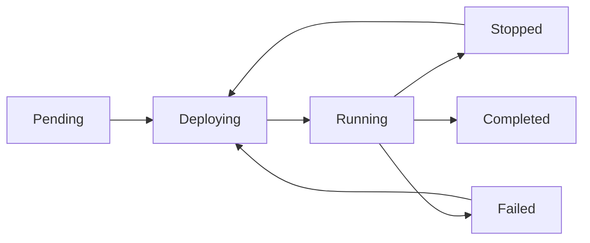

# Understanding Pipelines

Pipelines are the core abstraction in Flow, representing a complete data processing workflow from source to destination. Each pipeline defines how blockchain data flows through your system, what transformations to apply, and where to deliver the results.

## Pipeline Architecture

A Flow pipeline consists of three main components:

```
┌─────────────┐     ┌──────────────┐     ┌─────────────┐
│   Source    │────▶│  Processor   │────▶│  Consumer   │
│  (Network)  │     │ (Transform)  │     │(Destination)│
└─────────────┘     └──────────────┘     └─────────────┘
```

### 1. Source (Network)
The blockchain network providing data:
- **Stellar Mainnet**: Production network
- **Stellar Testnet**: Development network
- **Starting Point**: Latest, genesis, or specific ledger

### 2. Processor
Transforms raw blockchain data:
- Filters relevant information
- Structures data for consumption
- Can be chained for complex transformations

### 3. Consumer
Delivers processed data to your application:
- Databases (PostgreSQL, Redis)
- Streaming (Webhooks, Kafka)
- Storage (S3, DuckDB)

## Pipeline Lifecycle

### States

Pipelines progress through several states during their lifecycle:



- **Pending**: Configuration validated, awaiting deployment
- **Deploying**: Resources being allocated and services starting
- **Running**: Actively processing data
- **Stopped**: Manually paused by user
- **Failed**: Error occurred during processing
- **Completed**: Finished processing (for historical ranges)

### Deployment Process

1. **Validation**: Configuration checked for errors
2. **Security**: Credentials stored in Vault
3. **Orchestration**: Services deployed via Nomad
4. **Initialization**: Processors connect to data source
5. **Processing**: Data flow begins

## Configuration

### Basic Configuration

```yaml
name: "payment-tracker"
network: "mainnet"
start_ledger: "latest"

processor:
  type: "payments_memo"
  config:
    memo_text: "REF"
    min_amount: "100"

consumer:
  type: "postgres"
  config:
    connection_string: "postgresql://..."
    batch_size: 50
```

### Advanced Configuration

#### Multiple Processors

Chain processors for complex logic:

```yaml
processors:
  - type: "contract_filter"
    config:
      contract_ids: ["CCTOKEN..."]
  - type: "contract_event"
    config: {}
```

#### Multiple Consumers

Send data to multiple destinations:

```yaml
consumers:
  - type: "postgres"
    config:
      connection_string: "postgresql://..."
  - type: "webhook"
    config:
      url: "https://api.example.com/events"
```

## Data Flow Patterns

### Linear Processing
Simple source → processor → consumer flow:
```
Network → Payments Processor → PostgreSQL
```

### Filtered Processing
Pre-filter before main processing:
```
Network → Contract Filter → Event Processor → Webhook
```

### Fan-Out Processing
One source, multiple destinations:
```
Network → Transaction Processor → PostgreSQL
                               └→ S3 Archive
```

### Complex DAG
Directed Acyclic Graph for advanced scenarios:
```
Network → Raw Transactions → Filter A → PostgreSQL
                          └→ Filter B → Kafka
```

## Performance Characteristics

### Throughput

Factors affecting pipeline throughput:

1. **Processor Complexity**: Simple filters > Complex transformations
2. **Network Selection**: Testnet typically has lower volume
3. **Consumer Batch Size**: Larger batches = higher throughput
4. **Data Volume**: Account-specific > Network-wide

### Latency

Expected latencies by configuration:

- **Real-time** (batch_size: 1): 100-500ms
- **Near real-time** (batch_size: 10): 1-5 seconds
- **Batch** (batch_size: 100): 10-30 seconds

### Resource Usage

Pipeline resource consumption varies by:

- **Data Volume**: More data = more resources
- **Processor Type**: Complex processors use more CPU
- **Consumer Type**: Database consumers may use more memory
- **Historical Processing**: Genesis start uses more resources

## Monitoring & Observability

### Metrics

Flow provides built-in metrics:

- **Events Processed**: Total count and rate
- **Processing Latency**: Time from ledger close to delivery
- **Error Rate**: Failed events percentage
- **Consumer Lag**: Backlog size

### Logs

Real-time log streaming includes:

- **System Logs**: Deployment and lifecycle events
- **Processing Logs**: Data flow information
- **Error Logs**: Detailed error messages
- **Debug Logs**: Verbose troubleshooting info

### Health Checks

Automatic health monitoring:

```json
{
  "pipeline_id": "pipe_123",
  "status": "running",
  "health": {
    "processor": "healthy",
    "consumer": "healthy",
    "lag": 2,
    "error_rate": 0.01
  }
}
```

## Error Handling

### Automatic Recovery

Flow handles common errors automatically:

1. **Transient Network Errors**: Automatic retry with backoff
2. **Consumer Unavailable**: Buffer and retry
3. **Rate Limits**: Automatic throttling
4. **Service Restarts**: Resume from last checkpoint

### Manual Intervention

Some errors require user action:

- **Configuration Errors**: Fix and redeploy
- **Authentication Failures**: Update credentials
- **Schema Mismatches**: Adjust processor/consumer
- **Resource Limits**: Optimize configuration

## Best Practices

### 1. Start Simple
Begin with basic configurations and add complexity as needed.

### 2. Use Appropriate Filters
Filter early to reduce processing overhead:
```yaml
processor:
  config:
    addresses: ["GSPECIFIC..."]  # Process only specific accounts
```

### 3. Optimize Batch Sizes
Balance latency and throughput:
- Real-time alerts: batch_size: 1-10
- Analytics: batch_size: 50-100

### 4. Monitor Usage
Track costs and performance:
- Set up usage alerts
- Review processing metrics
- Optimize based on patterns

### 5. Plan for Growth
Design pipelines that can scale:
- Use filtering for large datasets
- Consider multiple smaller pipelines
- Plan consumer capacity

## Security Considerations

### Credential Management
- All credentials stored in Vault
- Automatic encryption at rest
- No credentials in logs or UI

### Network Security
- TLS for all connections
- Private networking available
- IP allowlisting supported

### Access Control
- Team-based permissions
- Audit logs for all actions
- Role-based access control

## Next Steps

- Learn about [Processors](../processors/) for data transformation
- Explore [Consumers](../consumers/) for data delivery
- Check our [Getting Started Guide](../getting-started/quickstart.md)
- Review [Pricing](../pricing.md) for cost information